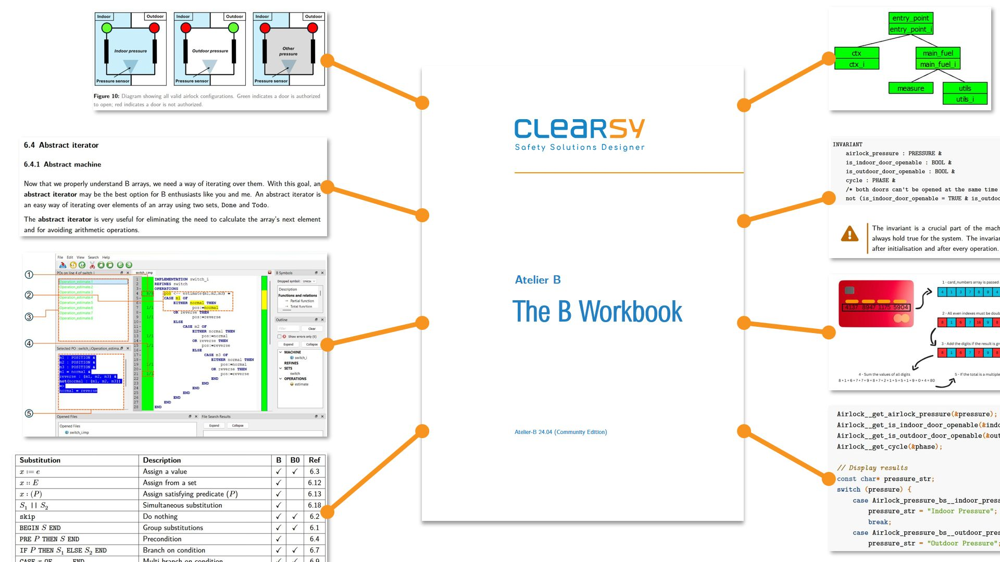
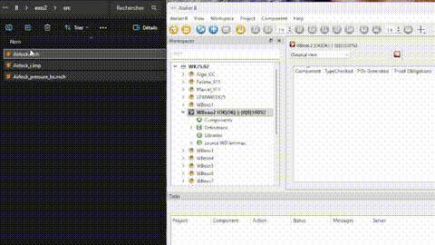

# B WORKBOOK

The B WORKBOOK is now available on CLEARSY's GitHub (https://github.com/CLEARSY/BWORKBOOK).
After several months of effort, the first version can be consulted and used for training in the use of formal methods and teaching the B method.

Many thanks to the contributors and reviewers, fromm Europe et South America, who have made this possible.

## CONTENTS

The B WORKBOOK now contains 7 exercises of increasing complexity, providing a step-by-step introduction to the various Atelier B functionalities.
It covers the phases of formal specification, implementation, proof, code generation and compilation of the final executable.
Each exercise is supplied with:
- modeling files,
- proof files that automatically demonstrate these models,
- additional manual source code and associated Makefile, for compilation in Unix environments (Windows WSL, Linux, MacOS).
It also contains instructions for using ProB to animate the models.

## INSTALLING MODELS

The 7 models are in this order:
- a simple railroad switch,
- an airlock operating system,
- an integer arithmetic calculator,
- a fuel level supervisor,
- a simple loop usage example,
- filling an array with a given value,
- find the maximum of an array.

Create one project per example. 
Before creating a project with Atelier B: 
- create a directory for the project in a place where your have read/write access;
- create subdirectories *bdp*, *lang*, and *src*;
- when you create the project with Atelier B, on the second window:
	- For the *Project Database* field: select the *bdp* subdirectory just created. 
	- For the *Translations directory*: you don't need to select the *lang* directory as Atelier B already noticed its existence;
- move the source files (mch, ref, imp, pmm files) from the github to the *src* subdirectory;
- open the project, select the classical view,
- open a file explorer on the *src* subdirectory, select all the files, drag & drop the files on the Atelier B project panel: they have been added to your project.

- if a file is missing, it should appear on the Atelier B panel with a red cross. Just add the missing file to remove the error.

## WHAT'S NEXT ?

In a future iteration in 2026, new exercises will be added, covering in particular:
- Event-B modeling,
- Graphical animation of models with VisB,
- Rust code generation,
- Interactive proof, proof tactics and writing proof rules.

In the meantime, if you find errors or have ideas for exercises or technical topics to address, please interact through the mechanisms offered by GitHub (issues, PR).

Shield: [![CC BY 4.0][cc-by-shield]][cc-by]

This work is licensed under a
[Creative Commons Attribution 4.0 International License][cc-by].

[![CC BY 4.0][cc-by-image]][cc-by]

[cc-by]: http://creativecommons.org/licenses/by/4.0/
[cc-by-image]: https://i.creativecommons.org/l/by/4.0/88x31.png
[cc-by-shield]: https://img.shields.io/badge/License-CC%20BY%204.0-lightgrey.svg**
